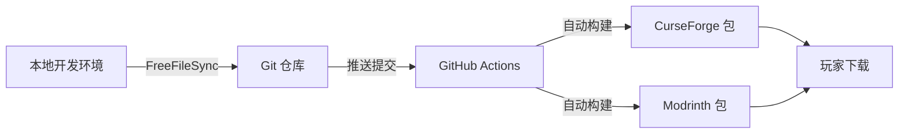

# GPFG 整合包开发工作流

> **G**it + **P**ackwiz + **F**reeFileSync + **G**itHub Actions  
> 专为 Minecraft 整合包开发设计的全链路自动化解决方案

## ✨ 特性亮点

- 🔄 **无缝同步** - FreeFileSync 智能同步开发环境与仓库
- 📦 **轻量分发** - Packwiz 元数据管理，包体积 < 100MB
- 🚀 **自动构建** - GitHub Actions 自动生成多平台发布包
- 🎯 **双平台支持** - 同时支持 CurseForge 和 Modrinth
- 🔍 **版本追踪** - Git 完整记录每次变更，支持快速回滚
- 📚 **文档集成** - VitePress 驱动的项目文档站点

## 🏗️ 工作流程概览



GPFG 工作流实现了从开发到发布的全流程自动化：

1. **本地开发** - 在真实 Minecraft 环境中测试整合包
2. **智能同步** - FreeFileSync 自动过滤并同步关键文件
3. **版本控制** - Git 追踪所有配置变更，支持协作开发
4. **自动发布** - 提交后自动构建兼容各大启动器的发布包

## 🚀 快速开始

### 1. 环境准备

**必需工具：**
- [Git](https://git-scm.com/) - 版本控制
- [Go](https://golang.org/) - 用于安装 Packwiz
- [FreeFileSync](https://freefilesync.org/) - 文件同步

**安装 Packwiz：**
```bash
go install github.com/packwiz/packwiz@latest
```

### 2. 项目设置

**克隆仓库：**
```bash
git clone https://github.com/your-username/your-modpack.git
cd your-modpack
```

**配置 FreeFileSync：**
1. 打开 `SyncSettings.ffs_gui`
2. 修改路径配置：
   - **左侧路径**：你的 Minecraft 开发环境目录（如 `.minecraft`）
   - **右侧路径**：仓库中的 `pack` 目录
3. 保存配置文件

**初始化 Packwiz：**
```bash
cd pack
packwiz init
```

### 3. 开发工作流

**日常开发步骤：**

1. **开发阶段** - 在本地 Minecraft 环境中：
   ```bash
   # 添加新模组
   cd pack
   packwiz curseforge add <mod-name>
   
   # 或从 Modrinth 安装
   packwiz modrinth add <mod-name>
   ```

2. **同步变更** - 使用 FreeFileSync：
   - 打开同步脚本
   - 选择要同步的文件
   - 点击"同步"按钮
   - 系统会自动过滤并同步必要文件

3. **提交发布**：
   ```bash
   git add .
   git commit -m "添加新模组: ModName"
   git push
   ```

4. **自动构建** - GitHub Actions 将自动：
   - 检测到推送后启动构建
   - 生成 CurseForge (.zip) 和 Modrinth (.mrpack) 格式
   - 上传到 Artifacts 供下载测试

## 📁 项目结构

```
├── .github/
│   ├── workflows/
│   │   └── curseforge_build.yml     # CurseForge 自动构建
│   └── modrinth_build/
│       ├── README.md                # Modrinth 构建说明
│       └── modrinth_build.yml       # Modrinth 构建工作流
├── pack/                            # 整合包核心目录
│   ├── .gitattributes              # Git 属性配置
│   ├── .packwizignore              # Packwiz 忽略文件
│   └── [整合包配置文件]             # 模组列表、配置等
├── wiki/                           # VitePress 文档站点
│   ├── .vitepress/
│   ├── index.md
│   └── [其他文档]
├── SyncSettings.ffs_gui            # FreeFileSync 同步配置
├── README.md                       # 项目说明文档
└── LICENSE                         # 许可证文件
```

## ⚙️ 高级配置

### 切换构建平台

**启用 Modrinth 构建：**
1. 将 `.github/modrinth_build/modrinth_build.yml` 移动到 `.github/workflows/`
2. 可选择性禁用 CurseForge 构建工作流

**自定义构建流程：**
- 编辑对应的 `.yml` 文件
- 修改触发条件、构建参数等

### 文档站点部署

**本地预览：**
```bash
cd wiki
npm install
npm run docs:dev
```

**部署到 Vercel/Netlify：**
- 连接 Git 仓库
- 设置构建目录为 `wiki`
- 构建命令：`npm run docs:build`

## 🤝 协作开发

### 团队协作流程

1. **Fork 仓库** 或获得协作者权限
2. **创建功能分支**：
   ```bash
   git checkout -b feature/new-mods
   ```
3. **本地开发测试** 使用相同的 FreeFileSync 配置
4. **提交 Pull Request** 并描述变更内容
5. **代码审查** 确保整合包稳定性
6. **合并发布** 自动触发构建流程

## 📄 许可证

本项目采用 [Creative Commons Attribution-NonCommercial-NoDerivatives 4.0 International License](http://creativecommons.org/licenses/by-nc-nd/4.0/) 许可证。

**简单来说：**
- ✅ 可以下载、使用、分享
- ❌ 不可用于商业用途
- ❌ 不可制作衍生作品
- ✅ 需要注明原作者

## 🙏 致谢

- [Packwiz](https://github.com/packwiz/packwiz) - 优秀的整合包管理工具
- [FreeFileSync](https://freefilesync.org/) - 强大的文件同步软件
- [VitePress](https://vitepress.dev/) - 现代化文档站点生成器
- Minecraft 模组开发社区的无私贡献